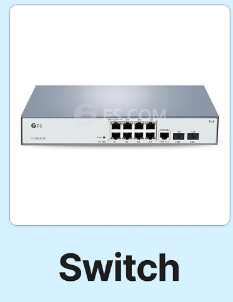

#### MITM 
Man In The Middle Attack - 중간자 공격.

👍 `클라이언트`<----------------------------->`서버`  
🚨 `클라이언트`<----------`공격자`---------->`서버`

---


# Sniffing

네트워크를 통과하는 데이터 패킷을 감시하고 수집하는 행위.

# Sniffer

Sniffing Tools

- **Network-Sniffer** : 트래픽 또는 패킷 분석을 함.
  > - _Wireshark_ :
  > - _tcpdump_ :
- **Screen-Sniffer** : 스샷 캡처 함.
  > - _Window스샷도구`(win+shift+s)`_ 등의 캡쳐 툴 들
- **기타 스니핑 툴** : 웹 앱 자동화 및 테스트를 하기 위해 스니핑함. 
  > - _Selenium_ : 웹앱 자동화 및 테스트 오픈 소스 프레임워크
  > - _Ranorex_ 등... 

# Sniffing attack 종류와 원리

```text
근거리 통신망(LAN) 상에서 개별적으로 호스트1를 구별하기 위한 방법으로 이더넷2 인터페이스3는 MAC 주소를 갖게 되며, 모든 이더넷 인터페이스의 MAC 주소는 서로 다른 고유한 값을 가진다. 따라서 로컬 네트워크상에서 각 호스트는 유일하게 구별이 가능해진다. 이더넷은 로컬 네트워크 내의 모든 호스트가 같은 선을 공유하도록 되어 있는데 이로 인해 같은 네트워크내의 컴퓨터는 다른 컴퓨터가 통신하는 모든 트래픽을 볼 수 있게 된다. 하지만 이더넷 인터페이스는 자신의 MAC 주소를 갖지 않는 트래픽을 무시하는 특성의 필터링을 가지고 있다.
하지만 스니핑 공격은 필터링을 무시하고 모든 트래픽을 볼 수 있는 *Promiscuous 모드를 설정하여 트래픽을 도청하는 방식을 취한다.
```

```
* Promiscuous Mode
사전적 정의로는 컴퓨터 네트워킹에서, 무차별 모드는 유선 네트워크 인터페이스 컨트롤러 또는 무선 네트워크 인터페이스 컨트롤러를위한 모드로, 컨트롤러가 특별히 수신하도록 프로그래밍 된 프레임 만 전달하지 않고 컨트롤러가 수신하는 모든 트래픽을 중앙 처리 장치로 전달하는 기능이다.
통상적으로 허브(HUB) 같은 스위치(Switch)에서 TCP/IP 프로토콜에서 목적지를 찾기위해 모든 장비에 브로드캐스트를 하게되면,
해당 스위치에 연결된 모든 NIC(Network Interface Card)는 자신에게 알맞는 패킷인 경우 허용하고 그렇지 않은 경우 해당 패킷을 폐기하게 된다.
일반적으로 시스템에 부하를 많이 주기때문에 대부분 기본적으로 비활성화(Disabled) 되어있다. 
상황에 따라서 해당 기능을 인터페이스에서 활성화하게 되면, 해당 인터페이스는 자신에게 온 패킷이 아님에도 불구하고 해당 패킷을 받아 유지하게되고, 해당 데이터를 조합하여 다른 정보를 스틸할 수도 있다.
간단히 말하자면 데이터 링크 계층과 네트워크 계층의 정보를 이용한 필터링을 해제하는 역할을 하는것이다.
```


#### 1.Switch Jamming Attack
스위치가 MAC 주소 테이블을 기반으로 포트에 패킷을 스위칭할 때 정상적인 스위칭 기능을 마비 시키는 공격이다. `MACOF` 공격이라고 불리기도 함

```txt
스위치는 자신이 가지고 있는 MAC 테이블의 저장 공간이 가득차면 네트워크 패킷을 브로드 캐스트 하는 특성이 있는데 이를 이용한 공격 방법임.

스위치 재밍 공격의 공격 원리: 
스위치가 관리하는 MAC 주소 테이블에 정보가 모두 입력되서 테이블이 가득차면 허브(HUB)처럼 패킷을 브로드 캐스트하게 되는데 공격자는 위조된 MAC 주소를 계속해서 스위치로 전달하고 스위치는 위조된 MAC 주소로 MAC 테이블을 채우게 된다. 그렇게 스위치의 MAC 테이블을 오버플로우 시키게 되면 브로드 캐스트로 인해 모든 패킷을 공격자가 받을 수 있게된다.
이 때 네트워크 통신 속도가 현저히 저하되서 공격자에게도 영향이 있게 된다.
현대 고가의 스위치는 MAC 테이블의 캐시와 연산자가 쓰는 캐시가 독립적으로 구성되어 있어 스위치 재밍 공격을 통하지 않는다.
``` 

#### 2, Port mirroring Attack
Switch의 포트 미러링 기능을 이용한 공격 방법.  
포트 미러링이랑 각 포트에 전송되는 데이터를 미러링하는 포트에도 동일하게 전달하여 침입 탐지 시스템, 네트워크 모니터링, 로그 시스템 등에 많이 사용된다.
공격자는 미러링 된 포트를 이용하여 모든 정보를 볼 수 있게 된다.

---

외에 ARP,ICMP를 우회하는 스니핑 기술들이 있다.

