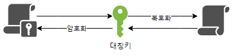
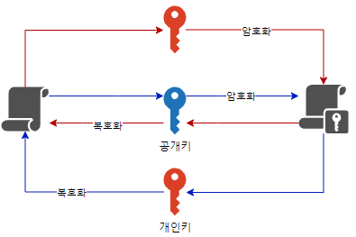
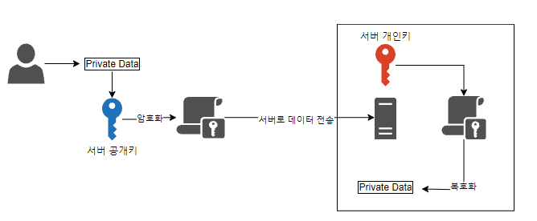
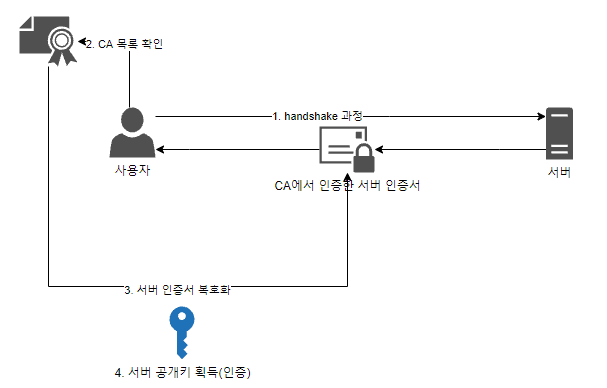

# HTTPS의 핵심기술

> HTTPS는 스푸핑을 방어하기 위해 크게 두가지 기술을 사용함.

- 암호화(Encryption): 데이터를 아무도 못알마보게 암호로 바꿈
- 인증서(Certificate): 접속하려는 서버가 찐인지 신분을 확인하는 기술

>> "컴퓨터 암호학의 핵심 개념은 보안과 인증이고, 
 `기밀성`,`무결성`,`효율성`을 보장해야한다.

기밀성: 인가받은 사용자만 정보 자산에 접근할 수 있음을 보장하는 것  
무결성: 권한을 가진 사용자에 의해 인가된 방법으로만 정보를 변경할 수 있음을 보장하는 것  
효율성: 정보에 대한 접근과 사용이 적시에 확실히 보장하는 것  

---

### HTTPS의 암호화 방식 - 1. 대칭키 암호화 방식
  
`symmetric-key security method`   
암호화 키 == 복호화 키 알고리즘.   
{Session Key=Secret Key=Shared Key, 대칭키, 단용키} 라고도 불림.
  - 장점 :
    -  "구현이 용이하다"
    -  "데이터를 암호화하기 위한 연산이 빨라 대용량 데이터 암호화에 적합하다"
  - 단점 : 
    - "강한 보안을 위해 키를 주기적으로 교체해야함."
    - "키 탈취 및 관리가 어렵다"
    - "무결성 지원이 부분적으로만 가능하다"
    - "부인 방지 기능 없다.(발행자 증명 기능X)"
  - 종류 :
    - 대칭키 방식-블록 암호(block cipher) 방식:
      ```md
      기밀성 있는 데이터를 정해진 블록 단위로 암호화 하는 대칭키 암호시스템.  
      만약 암호화하려는 데이터가 정해진 블록의 길이를 초과하면 특정  운용 모드가 사용됨.
      - SEED
      - HIGHT(High security and light weight)
      - ARIA
      - LEA(Lightweight Encryption Standard)
      - DES(Data Encryption Standard)
      - AES(Advanced Encryption Standard)
      ```
    - 대칭키 방식-스트림 암호(stram cipher) 방식: 
      ```md
      2진화된 평문 stram과 2진 Key 스트림의 배타연산XOR으로 암호문을 생성.  
      - RC4
      A5/1, A5/2, A5/3
      ```
       
### HTTPS의 암호화 방식 - 2. 비대칭키 암호화 방식

암호화 키 != 복호화 키  
외부에 절대 노출되면 안되는 개인키(Private Key)와 공개키(Public Key)가 쌍으로 이뤄져 있음.
- 

  - 장점 :
    -  "키 분배 및 키 관리가 용이하다"
    -  "기밀성, 무결성 지원"
    -  "부인 방지 기능 제공(발행자 증명)"
    -  "암호학의 핵심이라는 [데이터 보안]과 [인증]"    
       - [데이터-보안!]
          
       공개키 암호화 -> 개인키 암호화: 데이터를 안전하게 전송할 수 있다는 보안 기능을 제공. 이를 통해 제3자는 클라이언트가 서버로 보내는 데이터를 관음할 수 없음. 

       - [인증!]
         
       개인키 암호화 -> 공개키 암호화: 신뢰할 수 있는 IP라는 것을 인증할 수 있는 기능 제공
  - 단점 : 
    - "키 길이 너무 김. 그래서 연산속도도 느림"
  - 종류 :
    - RSA
    - 디피-헬만(Diffie-Hellman)
    - 타원곡선암호(Elliptic Curve Cryptosystem, ECC)
    - 전자서명(digital signature)
      ```md
      기밀성 있는 데이터를 정해진 블록 단위로 암호화 하는 대칭키 암호시스템.  
      만약 암호화하려는 데이터가 정해진 블록의 길이를 초과하면 특정  운용 모드가 사용됨.
      - SEED
      - HIGHT(High security and light weight)
      - ARIA
      - LEA(Lightweight Encryption Standard)
      - DES(Data Encryption Standard)
      - AES(Advanced Encryption Standard)
      ```
    - 대칭키 방식-스트림 암호(stram cipher) 방식: 
      ```md
      2진화된 평문 stram과 2진 Key 스트림의 배타연산XOR으로 암호문을 생성.  
      - RC4
      A5/1, A5/2, A5/3
      ```

