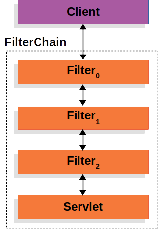

# 목표 
Spring security 개념과 원리 파악


[spring-security#learn](https://spring.io/guides/gs/securing-web)  
---

## SecurityFilter

`Filter 형식`.




---

(클라이언트 요청 -> | | | | -> 스프링부트)

이렇게 시큐리티가 클라이언트와 스프링부트 사이에서 필터들이 겹겹이 세워짐.

그리고 그 필터들은 각각 인증담당필터,인가체크담당필터,,,,등의 역할을 수행함.

---

### 인증 처리 과정


클라이언트가 로그인 정보를 폼 또는 API로 보낸다.

인증 필터가 요청을 가로채서 인증 토큰 생성

인증 매니저가 인증 프로바이더에 인증 위임

프로바이더가 UserDetailsService 통해 DB 조회

DB에서 사용자 정보 꺼내 비밀번호 검증 후 인증 성공 여부 판단

성공 시 SecurityContext에 인증 정보 저장

이후 요청 처리 및 권한 검사로 진행

```md 
1. 클라이언트에서 로그인 POST 요청.
  ↓ ([username, password] 전달)
1. `UsernamePasswordAuthenticationFilter`가 요청 받아서 
  ↓ ([username, password] 추출)
  ↓ (인증요청토큰`UsernamePasswordAuthenticationToken` 생성)
1. `AuthenticationManager`(ProviderManager)
  ↓(여러 `AuthenticationProvider` 중 적합한 프로바이더에 위임)
1. `AuthenticationProvider`==`DaoAuthenticationProvider`
  ↓
1. `UserDetailsService.loadUserByUsername(username)`
  ↓ (DB에서 유저 정보 조회 → UserDetails 반환)
1. `AuthenticationProvider`
  ↓(비밀번호 등 인증 정보 검증)
  ↓(성공 시 `Authentication` 객체 생성 `authenticated=true`)
1. `AuthenticationManager` ← 반환된 인증 성공 객체
  ↓
1. `UsernamePasswordAuthenticationFilter`
  ↓(SecurityContextHolder.getContext().setAuthentication(authentication))
SecurityContextHolder (인증정보 저장)
  ↓
1. 필터 체인 계속 진행 → Controller 등 요청처리로 넘어감

``` 

---
