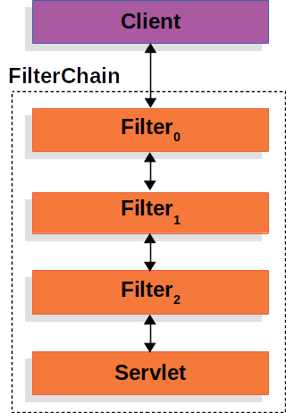
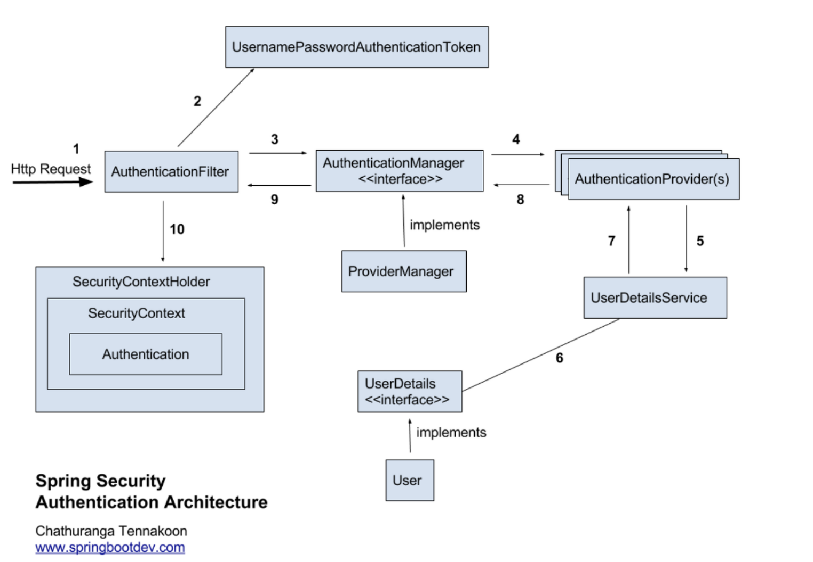

# [spring security] Chapter-2. SecurityFilterChain

`spring security`는 '필터 기반 동작' 이라는 컨셉으로 동작함.

다시 말해 동작 방식에 대한 유형임.

그림으로 보자면,

이렇게 생김.

---

- 시큐리티 적용 전 

(클라이언트 요청 -> 서블렛)

이렇게 http 세션이 서블렛으로 직빵으로 갔었는데,

- 시큐리티 적용 후

(클라이언트 요청 -> | | | | -> 서블렛)

이렇게 시큐리티가 클라이언트와 서블렛 사이에서 필터들이 겹겹이 세워짐.

그리고 그 필터들은 각각 인증담당필터,인가체크담당필터,,,,등의 역할을 수행함.

---

그럼 각각 필터들이 뭘하는지 알게 됐다.

그래서 **' 인증 처리는 어떻게 하는가? '** 에 대해 알아보자.

그러려면 그 과정을 살펴봐야한다.

## 인증 처리 과정

1. Http Request 수신

사용자가 로그인 정보와 함께 인증 요청을 합니다.

    "나 여기 단골 철수(session)에요, 내 민증 보고 확인해봐요" 라며
    클럽문지기(AuthenticationFilter)한테 신분증을 보여줌.

2. 유저 자격을 기반으로 인증토큰 생성

AuthenticationFilter가 요청을 가로채고, 가로챈 로그인 정보를 통해 UsernamePasswordAuthenticationToken의 인증용 객체를 생성합니다.

    클럽문지기(AuthenticationFilter)가 철수(session)의 신분증(로그인 정보)을 받아서 확인하고
    이름(userName)과 주민번호(Password) 적힌 쪽지(UsernamePasswordAuthenticationToken)를 씀.

3. FIlter를 통해 AuthenticationToken을 AuthenticationManager로 위임

AuthenticationManager의 구현체인 ProviderManager에게 생성한 UsernamePasswordToken 객체를 전달합니다.

    클럽문지기(AuthenticationFilter)가 그 쪽지(Token)를 실제 사장(AuthenticationManager)한테 전달함.
    사장(AuthenticationManager)은 "너네 김철수라고 아냐" 라며
    여러 부하 직원들(ProviderManager) 중 한 명한테 그 쪽지를 전달함.

4. AuthenticationProvider의 목록으로 인증을 시도

AutenticationManger는 등록된 AuthenticationProvider들을 조회하며 인증을 요구합니다.

    직원들(AuthenticationProviders)이 그 쪽지(Token)를 보면서 
    "김철수(session)? 얘 우리 단골이었나?" 하면서 '인증'을 시도함.

5. UserDetailsService의 요구

실제 데이터베이스에서 사용자 인증정보를 가져오는 UserDetailsService에 사용자 정보를 넘겨줍니다.

    부하 직원 중 한 명이 클럽 회원 명부(UserDetailsService)가져옴.
    명부에는 모든 단골들의 정보(UserDetails)가 있음.

6. UserDetails를 이용해 User객체에 대한 정보 탐색

넘겨받은 사용자 정보를 통해 데이터베이스에서 찾아낸 사용자 정보인 UserDetails 객체를 만듭니다.

    명부에서 철수를 찾아보고, 찾으면 쪽지에 그 정보(UserDetails)를 적음.
7. User 객체의 정보들을 UserDetails가 UserDetailsService(LoginService)로 전달

AuthenticaitonProvider들은 UserDetails를 넘겨받고 사용자 정보를 비교합니다.

    그 쪽지를 들고 사장한테 다시 감.
    "사장님, 이 사람 우리 단골 철수 맞아요. 들어와도 돼요."
8. 인증 객체 or AuthenticationException

인증이 완료가되면 권한 등의 사용자 정보를 담은 Authentication 객체를 반환합니다.

    사장이 그 쪽지를 보고 오케이 도장(Authentication) 찍어주면 인증 완료.
    만약 명부에 철수의 이름,주민번호와 일치하는 데이터가 없었으면 쫓겨남(AuthenticationException).

9. 인증 끝

다시 최초의 AuthenticationFilter에 Authentication 객체가 반환합니다.

    이제 오케이 도장이 찍힌 쪽지를 클럽문지기(AuthenticationFilter)한테 다시 전달함.
10. SecurityContext에 인증 객체를 설정

Authentication 객체를 Security Context에 저장합니다.

    클럽문지기(AuthenticationFilter)는 이제 그 쪽지를 금고(SecurityContext)에 넣어두고,
    철수가 매번 이 인증을 할 필요 없게 해줌.

### 결론

사용자가 로그인 정보 주면, 그걸로 토큰 만들고, 관리자들이 찾아보고, 오케이 되면 들어가게 해준다.

---
